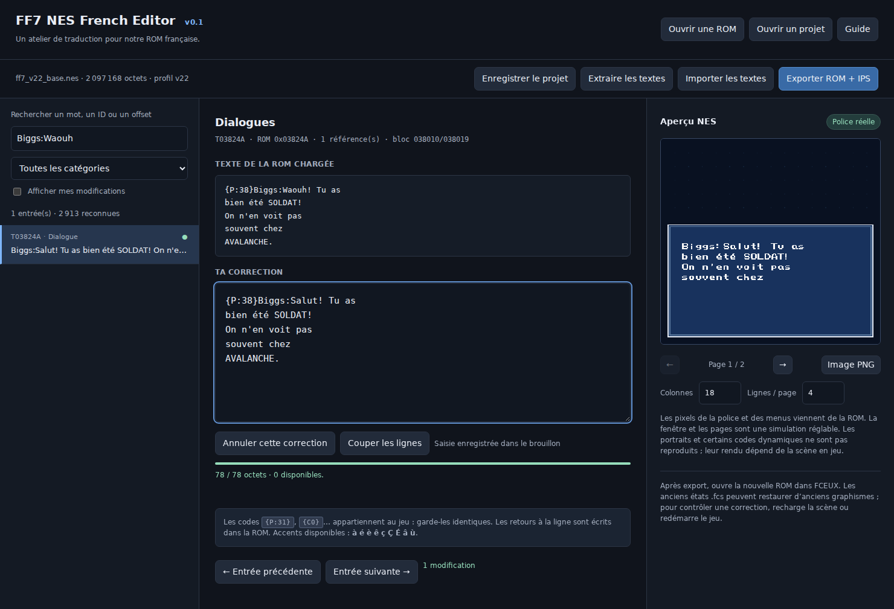

# FF7 NES French Editor

Éditeur graphique autonome pour la ROM française FF7 NES v22. Il permet de rechercher et modifier les textes, de voir leur rendu avec la police du jeu, puis d’exporter une ROM et un patch IPS.

## Utilisation

1. Télécharger et extraire [le pack v0.1](FF7_NES_EDITOR_v0_1.zip), ou cloner ce dépôt.
2. Ouvrir `FF7_NES_EDITOR.html` dans un navigateur récent.
3. Charger `ff7_v22_base.nes`.
4. Modifier les entrées et contrôler l’aperçu.
5. Enregistrer un projet `.ff7fr` pour reprendre le travail et exporter la ROM + IPS pour jouer dans FCEUX.

Aucune installation ni connexion réseau n’est nécessaire pour utiliser l’éditeur.



## Couverture et limites

- 2 896 textes reconnus, dont 2 130 dialogues, et 17 libellés graphiques.
- Les textes doivent tenir dans leur emplacement actuel ; les dépassements empêchent l’export.
- Cinq entrées partagées sont protégées. Quarante-cinq références ne sont pas reconnues par ce profil.
- Le profil correspond à la v22 incluse et aux ROM exportées par cet outil : mapper 163, taille 2 097 168 octets.
- L’aperçu utilise les pixels de la police du jeu ; la fenêtre et la pagination sont indicatives. Les portraits et certains codes dynamiques ne sont pas reproduits.
- Les états FCEUX peuvent restaurer d’anciens graphismes. Recharger la scène ou redémarrer la ROM après une correction.

Les détails figurent dans [LISEZ_MOI.txt](LISEZ_MOI.txt) et les résultats de validation dans [VALIDATION.txt](VALIDATION.txt). Ces contrôles ne certifient pas toutes les scènes du jeu.

## Développement

Les sources séparées sont dans `sources/`. Node.js sert aux tests du moteur ; Python 3 permet de reconstruire le HTML autonome.

```sh
python3 sources/build_html.py
node sources/test_core.js
```

Les mêmes commandes sont disponibles avec `npm run build` et `npm test`.

Le test d’interface utilise Playwright et Chromium :

```sh
npm install --no-save playwright
npx playwright install chromium
node sources/test_ui.js
```

Un navigateur existant peut être indiqué dans `FF7_TEST_BROWSER`, ses bibliothèques dans `FF7_TEST_LIBS`. Voir aussi [sources/DEVELOPPEMENT.txt](sources/DEVELOPPEMENT.txt).

`make_manifest.py` documente la cartographie spécifique à la v22 ; ce n’est pas un analyseur universel. Toute modification des pointeurs ou du code exige de reprendre cette analyse.

## Contenu du dépôt

| Emplacement | Contenu |
| --- | --- |
| `FF7_NES_EDITOR.html` | Application autonome générée |
| `sources/` | Moteur, interface, profil, générateur et tests |
| `ff7_v22_base.nes` | Base française v22 |
| `FF7_NES_EDITOR_v0_1.zip` | Pack livré, avec sources et captures FCEUX |
| `FF7_PROJECT_ARCHIVE_20261005.zip` | Historique complet des fichiers de travail disponibles : anciennes ROM, patchs, scripts, audits, sauvegardes et captures |

Les patchs successifs nécessitent la version de départ indiquée dans leur nom. Le patch exporté par l’éditeur nécessite exactement la ROM chargée, dont l’empreinte figure dans le bilan d’export.

Les graphismes et données du jeu restent la propriété de leurs ayants droit. Ce dépôt ne leur attribue pas une nouvelle licence.

## Conservation des travaux précédents

L’[archive du projet](FF7_PROJECT_ARCHIVE_20261005.zip) conserve les fichiers disponibles lors de l’envoi : corrections des menus et des PV, ROM intermédiaires, scripts d’analyse, scripts Lua de validation, audits, données RAM/PPU/CHR, sauvegardes et captures. Son `ARCHIVE_INDEX.json` détaille chaque fichier avec sa taille et son empreinte SHA-256. Les noms et dossiers historiques sont conservés.

Les exports d’essai sont distincts de la v22 de base. Les scripts historiques peuvent nécessiter l’adaptation de leurs chemins.
